# Airdrop Web Application
Actual version
you can find on https://rc-airdrop.vercel.app
Example dApp for showcasing how to integrate with a smart contract on the Concordium blockchain.
The project was bootstrapped with Vite.

## Install
Run installation in the root of the project.
```bash
npm install
```

## Run
Run the app in development mode with
```bash
npm run dev
```
This spins up a server which serves the app on http://localhost:5173.

Linting errors will appear in the console.

Changes to the source code will cause the page to refresh automatically.

## Build
Build the app for production using
```bash
npm run build
```
This will drop an optimized and minified bundle in the build folder that is ready to be deployed.

See the section about deployment for more information.

## About Web Application
The application provides a simple functionality to create and use airdrops.

On the main page you can download examples of metadata.json that are required to create an airdrop

To interact with the application you need the concordium wallet web extension

### Create

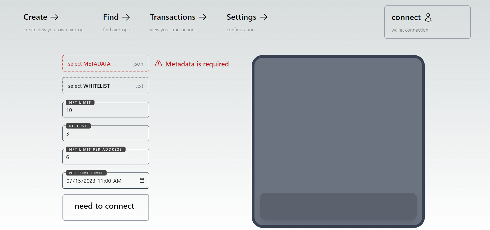

On the Create page you will find everything you need to create an airdrop using fields such as:
- METADATA - (select the metadata file (you can use the examples from the homepage)). After a successful upload, you will see information about your NFT.
- WHITELIST - (select an account whitelist file. The file is a set of wallet addresses that can pick up airdrop. The "," is used as a delimiter. For example "4n...QA,3b...KB,5g...SL".
- NFT LIMIT - maximum number of NFTs in this airdrop.
- RESERVE - The number of NFTs to whitelist. Only whitelist accounts can pick up these tokens.
- NFT LIMIT PER ADDRESS - the maximum number of NFTs that one account will be able to pick up.
- NFT TIME LIMIT - the date and time that the airdrop is closed. Once closed, NFTs cannot be picked up.

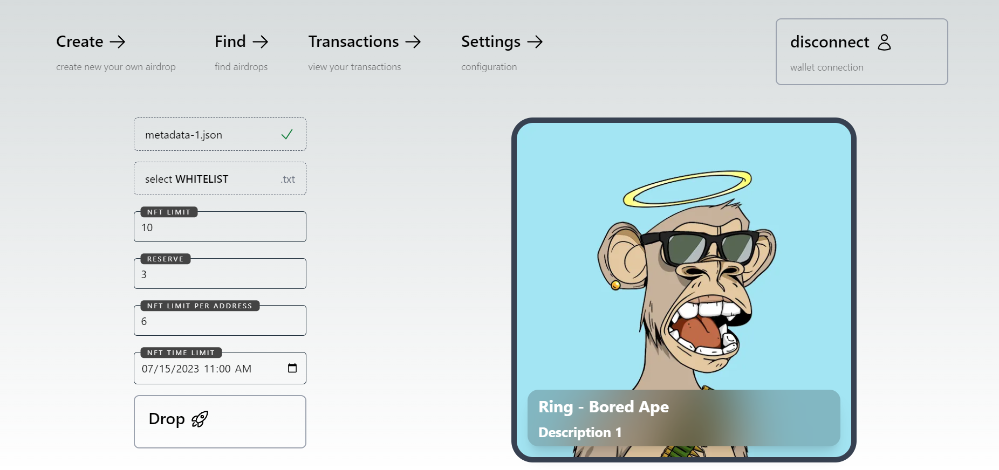

After you click on the drop button, an extension will open with the transaction.

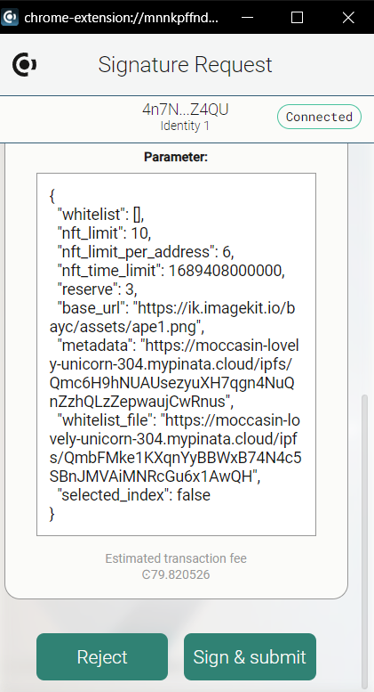

If you confirm it, you will see a loader with a link to concordium explorer where you can get more information about the transaction.

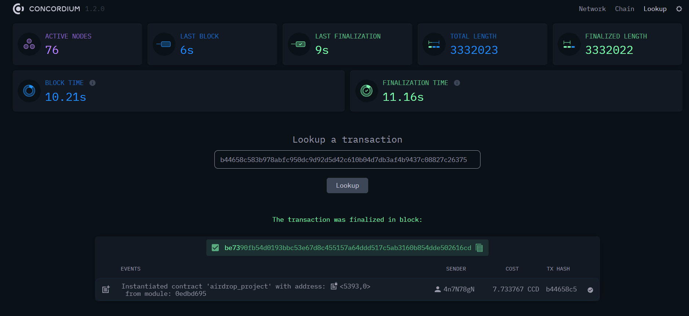

If the transaction was successful, you will see a green check mark in the loader and a link to the claim page.

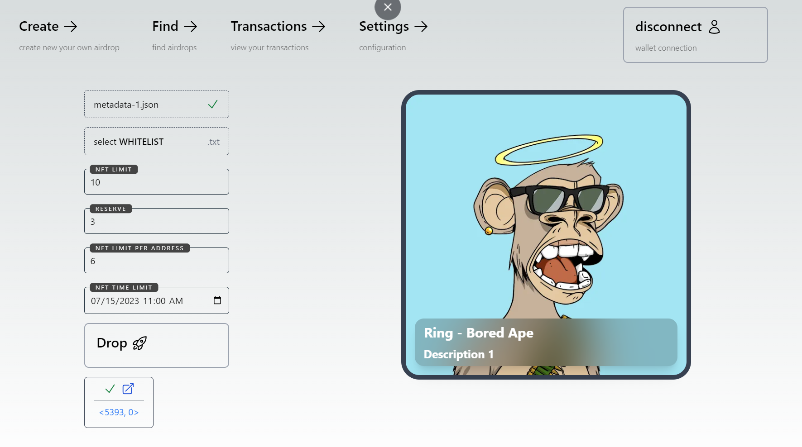

If the transaction failed, you will see a red cross and an error message in the loader.

### Find

On this page, you can find airdrops that interest them.

- INDEX - set the contract index that was reported when the airdrop was created
- SUBINDEX - in most cases set to 0

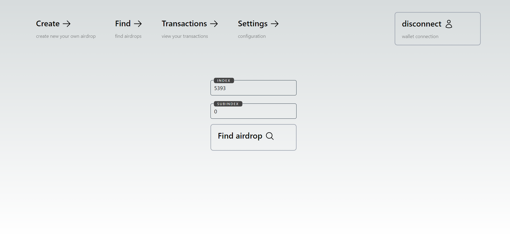

### Claim

On this page you can claim airdrops.

- AMOUNT OF NFTs - number of NFTs at claiming

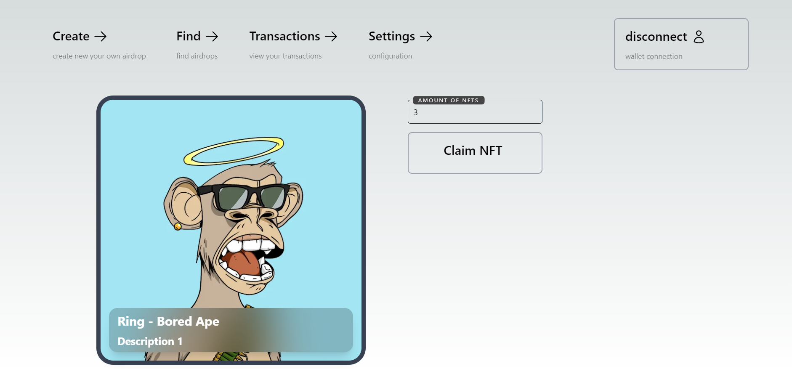
_base claim page_


_success claim page_

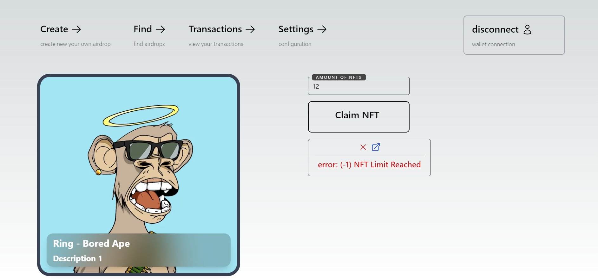
_error claim page_

### Transactions

On this page you can view all created transactions

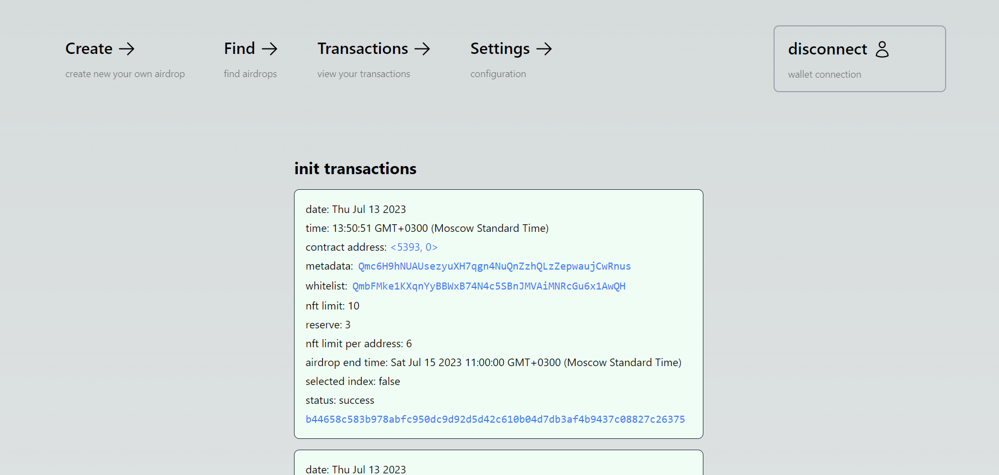
_transactions init (create)_

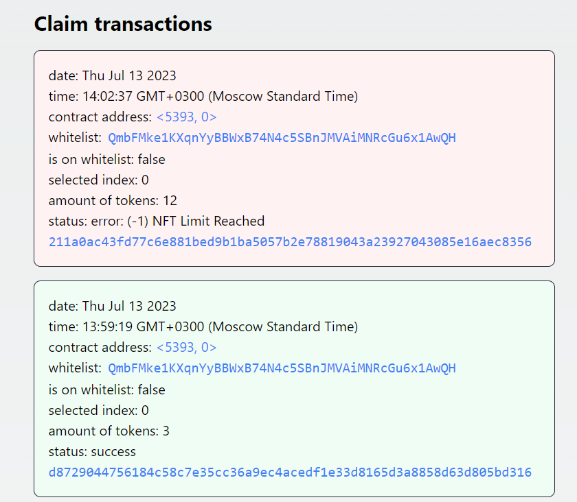
_transactions claim_

### Settings

On this page you can view all created transactions

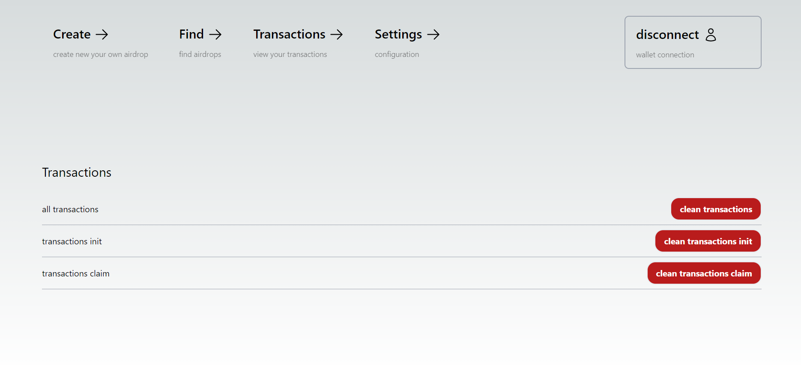

### Other

The application only supports the desktop solution. 
Mobile version is not supported
