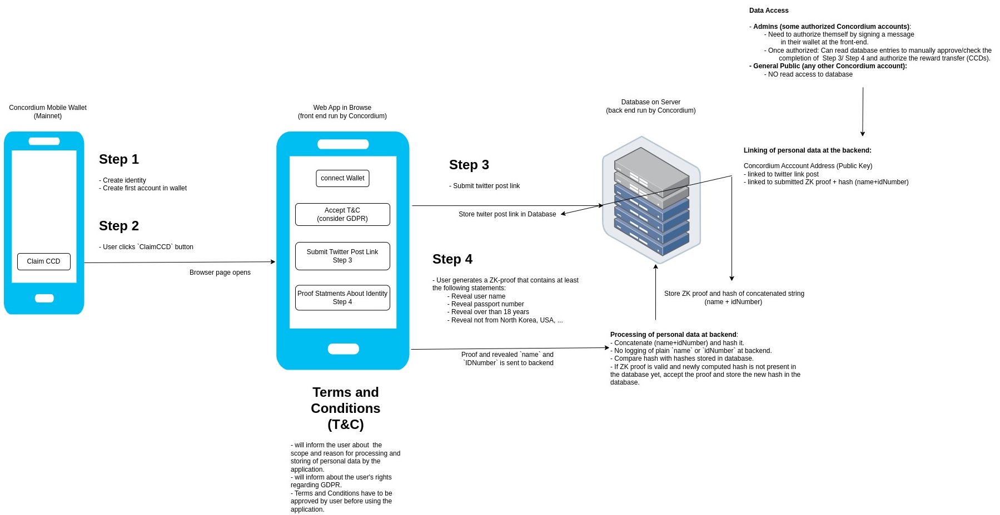

# Compliance Reward Distribution Dapp

## Architecture



## Hosted front end

[here](https://compliant-reward-distribution.testnet.concordium.com/)

## Overview

The project has three primary components.

- A [frontend](./frontend/README.md), located in `./frontend`
- An [indexer](./indexer-and-server/README.md) service, located in `./indexer-and-server`
- A [server](./indexer-and-server/README.md) that hosts the frontend, located in `./indexer-and-server`

Explanations for each component reside in README.md files inside their respective folder.

## Docker files

You can run the services and servers manually as explained in the READMEs or use the docker files in `./dockerfiles`.

However, the easiest option is to use [docker-compose](https://docs.docker.com/compose/) with the configuration file `./docker-compose.yml`.

For this to work, you should do the following:

1. Set the following environment variables:
   - (Optional) Set the `ADMIN_ACCOUNT` variable to an account address. This account can read and write to the database.
   - (Optional) Set the `CONCORDIUM_NODE` to the gRPC endpoint of the node you want to use. Defaults to `https://grpc.testnet.concordium.com:20000`.
2. Run `docker-compose up` to build and start all the services.

e.g.

```bash
ADMIN_ACCOUNT="4dT5vPrnnpwVrXZgmYLtHrDLvBYhtzheaK4fDWbJewqRCGQKWz" CONCORDIUM_NODE="https://grpc.mainnet.concordium.software:20000" docker-compose up
```

You might need to run the above command twice, if the postgres database container is too slow
to be set up for the first time and as a result the indexer or server throw an error because
they are already trying to connect. Stopping the command and re-running the command will load
the already setup postgres database container.

3. Access the frontend at `http://localhost:8080`
   - The postgres database runs on port `5432`. It is configurable in the `./docker-compose.yml` file.

### Restarting

Restaring the services with the `docker-compose up` command will load the old `compliant-reward-distribution_postgres_data`.
If you want to restart the containers with an empty database, stop and remove all containers, and delete the PostgreSQL database before running the `docker-compose up` command again.

To delete the volume, run the following command:

``` shell
   docker volume rm compliant-reward-distribution_postgres_data
```

