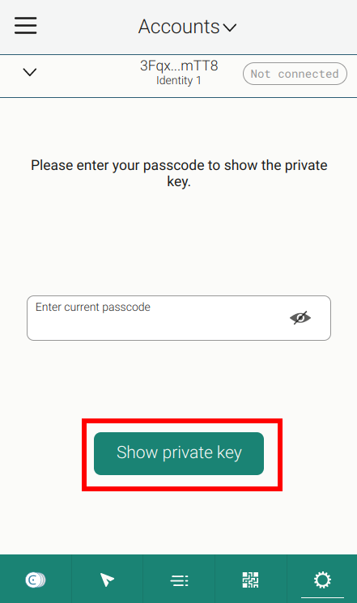

# Sponsored Transactions Web Application

The example project included in this repository serves as a working example of how to integrate sponsored transactions with smart contracts on the Concordium blockchain. The project has a frontend and a backend.

Clone the root repo with the following command:

```shell
git clone --recurse-submodules git@github.com:Concordium/concordium-dapp-examples.git
```

or
```shell
git clone --recurse-submodules https://github.com/Concordium/concordium-dapp-examples.git
```

To set up the project locally, complete the steps in the `README.md` file in the `sponsoredTransactions/frontend` folder and then complete the steps in the `README.md` file in the `sponsoredTransactions/backend` folder.

Alternatively, follow the steps to deploy the docker container below. This docker container will set up the frontend as well as the backend.

## Run as docker

Add your `ACCOUNT_KEY_FILE` to the repository's root folder and run the dockerfile from the repository's root folder with the command:
```shell
docker build -t sponsored_transactions -f sponsoredTransactions/Dockerfile .
```


The image can then be run with:
```shell
docker run -p 8080:8080 --mount type=bind,source="$(pwd)"/<ACCOUNT_KEY_FILE>,target=/KEY_FILE,readonly sponsored_transactions
```

e.g.

```shell
docker run -p 8080:8080 --mount type=bind,source="$(pwd)"/3PXwJYYPf6fyVb4GJquxSZU8puxrHfzc4XogdMVot8MUQK53tW.export,target=/KEY_FILE,readonly sponsored_transactions
```

Note: To get your `ACCOUNT_KEY_FILE` (the `3PXwJYYPf6fyVb4GJquxSZU8puxrHfzc4XogdMVot8MUQK53tW.export` file), export it from the Concordium Browser Wallet for Web.





See the [docker file](./Dockerfile) to explore the environment variables that can set.

Note: Use the same smart contract index for the frontend and backend. In other words, use the smart contract index from the `./frontend/package.json` file in the dockerfile.


## Explore the tutorial

You can find an associated tutorial on the [developer documentation](./https://developer.concordium.software/en/mainnet/smart-contracts/tutorials/index.html).


