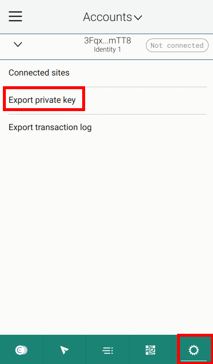
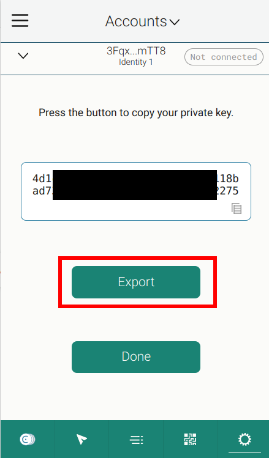

# The Sponsored Transactions Backend

This page describes the sponsored transactions backend for this dapp example.

# Supported configuration options

The following parameters are supported
- `node` the URL of the node's GRPC V2 interface, e.g., `http://node.testnet.concordium.com:20000`
- `port` the port on which the server will listen for incoming requests
- `log-level` maximum log level (defaults to `debug` if not given)
- `public-folder` the path to the folder, which should be served, defaults to the `public` folder in the current directory.
- `account` the path to a file which contains the key credentials.
- `smart-contract-index` the smart contract index which the sponsored transaction is submitted to.

All of the above is available by using `--help` to get usage information.

An example to run the backend with basic settings and testnet node would be:
```shell
cargo run -p sponsored-transaction-backend -- --node http://node.testnet.concordium.com:20000 --account <YourAccountPathToYourKeys> --smart-contract-index 9586  
```

An example to run the backend with some filled in example settings would be:

```shell
cargo run -p sponsored-transaction-backend -- --node http://node.testnet.concordium.com:20000 --port 8080 --account ./4SizPU2ipqQQza9Xa6fUkQBCDjyd1vTNUNDGbBeiRGpaJQc6qX.export --public-folder ../frontend/dist --smart-contract-index 9586
```

To get your account file (the `4SizPU2ipqQQza9Xa6fUkQBCDjyd1vTNUNDGbBeiRGpaJQc6qX.export` file in the above example), export it from the Concordium Browser wallet for web.
This account should be only used for this service. No transactions should be sent from the account by any other means to ensure the account nonce is tracked
correctly in the service (e.g. don't use the `4SizPU2ipqQQza9Xa6fUkQBCDjyd1vTNUNDGbBeiRGpaJQc6qX` account in the browser wallet to send transactions via the front end).





Note: Use the same smart contract index for the frontend and backend. In other words, use the SMART_CONTRACT_INDEX from the `../frontend/package.json` file when starting the backend server.

# Using the tool

The backend is a simple server that exposes two endpoints
 - `POST /submitUpdateOperator`
 - `POST /submitTransfer`

The overall flow is that the user signs a sponsored updateOperator/transfer message in the browser wallet (or mobile wallet via walletConnect) and sends the signature together with some input parameters to this backend server via one of the above endpoints. The backend creates a sponsored transaction and submits it to the `permit` function in the smart contract {index: SMART_CONTRACT_INDEX, subindex: 0}. You can look up the SMART_CONTRACT_INDEX in the `../frontend/package.json` file. The backend returns the transaction hash to the frontend. This backend server has to have access to a blockchain node and an account (with its associated private key) that is funded with some CCD to submit the sponsored transaction to the chain. The backend wallet will pay for the transaction fees.

The `/submitUpdateOperator` endpoint expects a JSON body with the fields shown in the example below:

``` json
{
   "signer":"2xoKcfFdJA1jCa7DEJborFdhxN78x3SuPhwu4haxdzUXRk5riH",
   "nonce":8,
   "signature":"b7cc2c4619c19876254f0f2f616b72396ffddcd70f9ed390c30c0ba76767cde31200152c1215c0c377de03e78efe467e017f59b542fec131a8cc53f94e28c70d",
   "operator":"3PXwJYYPf6fyVb4GJquxSZU8puxrHfzc4XogdMVot8MUQK53tW",
   "add_operator": false
   "timestamp":"2024-03-08T08:23:21.449Z",
}
```

The `/submitTransfer` endpoint expects a JSON body with the fields shown in the example below:


``` json
{
   "signer":"2xoKcfFdJA1jCa7DEJborFdhxN78x3SuPhwu4haxdzUXRk5riH",
   "nonce":8,
   "signature":"b7cc2c4619c19876254f0f2f616b72396ffddcd70f9ed390c30c0ba76767cde31200152c1215c0c377de03e78efe467e017f59b542fec131a8cc53f94e28c70d",
   "token_id":"0af4",
   "from": "3PXwJYYPf6fyVb4GJquxSZU8puxrHfzc4XogdMVot8MUQK53tW",
   "to": "2xoKcfFdJA1jCa7DEJborFdhxN78x3SuPhwu4haxdzUXRk5riH",
   "timestamp":"2024-03-08T08:23:21.449Z"
}
```

Note:
The smart contract code {index: SMART_CONTRACT_INDEX, subindex: 0} can be found [here](https://github.com/Concordium/concordium-rust-smart-contracts/tree/main/examples/cis3-nft-sponsored-txs).

# Contributing

[](https://github.com/Concordium/.github/blob/main/.github/CODE_OF_CONDUCT.md)

This repository's CI automatically checks formatting and common problems in rust.
Changes to any of the packages must be such that
- `cargo clippy --all` produces no warnings
- `rust fmt` makes no changes.

In order to contribute you should make a pull request and ask a person familiar with the codebase for a review.

## Building

The project is a pure Rust project, and can be built from the repo base directory by running:

```shell
cargo build --locked -p sponsored-transaction-backend --release
```

This produces a single binary `target/release/sponsored-transaction-backend`.

