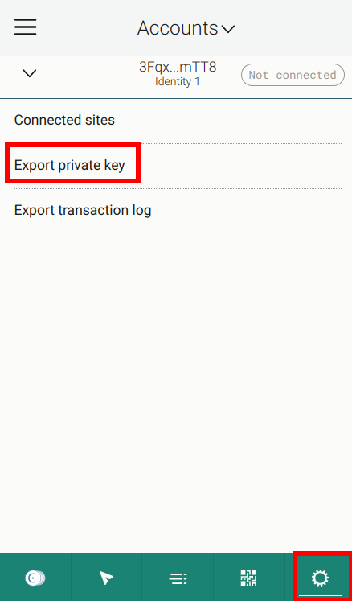

# The Sponsored Transactions Backend

This page describes the sponsored transactions backend for this dapp example.

# Supported configuration options

The following parameters are supported
- `node` the URL of the node's GRPC V2 interface, e.g., `http://node.testnet.concordium.com:20000`
- `port` the port on which the server will listen for incoming requests
- `log-level` maximum log level (defaults to `debug` if not given)
- `public-folder` the path to the folder, which should be served, defaults to the `public` folder in the current directory.
- `account-key-file` the path to a file which contains the key credentials.
- `cis2-token-smart-contract-index` the smart contract index which the sponsored transaction is submitted to.
- `auction-smart-contract-index` the smart contract index of the auction smart contract.

All of the above is available by using `--help` to get usage information.

An example to run the backend with basic settings and testnet node would be:
```shell
cargo run -- --node http://node.testnet.concordium.com:20000 --account-key-file <YourAccountPathToYourKeys> --cis2-token-smart-contract-index 7370 --auction-smart-contract-index 7415
```

An example to run the backend with some filled in example settings would be:

```shell
cargo run -- --node http://node.testnet.concordium.com:20000 --cis2-token-smart-contract-index 7370 --auction-smart-contract-index 7415 --account-key-file ./4SizPU2ipqQQza9Xa6fUkQBCDjyd1vTNUNDGbBeiRGpaJQc6qX.export --log-level debug 
```

To get your account file (the `3PXwJYYPf6fyVb4GJquxSZU8puxrHfzc4XogdMVot8MUQK53tW.export` file in the above example), export it from the Concordium Browser wallet for web.




Note: Use the same smart contract index for the frontend and backend. In other words, use the AUCTION_CONTRACT_INDEX and CIS2_TOKEN_CONTRACT_INDEX from the `../frontend/package.json` file when starting the backend server.

# Using the tool

The backend is a simple server that exposes one endpoint
 - `POST /bid`

The overall flow is that the user signs a sponsored transaction bid message in the browser wallet and sends the signature together with some input parameters to this backend server via the above endpoint. The backend creates a sponsored transaction and submits it to the `permit` function in the smart contract {index: CIS2_TOKEN_CONTRACT_INDEX, subindex: 0}. You can look up the CIS2_TOKEN_CONTRACT_INDEX in the `../frontend/package.json` file. The backend returns the transaction hash to the frontend. This backend server has to have access to a blockchain node and an account (with its associated private key) that is funded with some CCD to submit the sponsored transaction to the chain. The backend wallet will pay for the transaction fees.

Note:
The smart contract code at {index: CIS2_TOKEN_CONTRACT_INDEX, subindex: 0} can be found [here](https://github.com/Concordium/concordium-rust-smart-contracts/tree/main/examples/cis2-multi).
The smart contract code at {index: AUCTION_CONTRACT_INDEX, subindex: 0} can be found [here](https://github.com/Concordium/concordium-rust-smart-contracts/tree/main/examples/sponsored-tx-enabled-auction).

See [src/main.rs](./src/main.rs) for the formats of requests and responses. Both
requests and responses are JSON encoded. The requests are handled by handlers in [src/handlers.rs](./src/handlers.rs).

# Contributing

[](https://github.com/Concordium/.github/blob/main/.github/CODE_OF_CONDUCT.md)

This repository's CI automatically checks formatting and common problems in rust.
Changes to any of the packages must be such that

- ```cargo clippy --all``` produces no warnings
- ```rust fmt``` makes no changes.

Everything in this repository should build with rust version 1.65 however the `fmt` tool must be from a nightly release since some of the configuration options are not stable. One way to run the `fmt` tool is
```
cargo +nightly-2023-04-01 fmt
```

(the exact version used by the CI can be found in [.github/workflows/rust-fmt-lint.yaml](https://github.com/Concordium/concordium-dapp-examples/blob/main/.github/workflows/rust-fmt-lint.yaml) file).
You will need to have a recent enough nightly version installed, which can be done via

```
rustup toolchain install nightly-2023-04-01
```

## Building

The project is a pure Rust project, and can be built by running

```shell
cargo build --release
```

This produces a single binary `target/release/sponsored-transaction-backend`.
