# Cloudflare Turnstile setup

The purpose of this guide is to show how to configure the production domain in Vercel and the Cloudflare Turnstile service.

1. Go to the project in Vercel, then Settings/Domains
   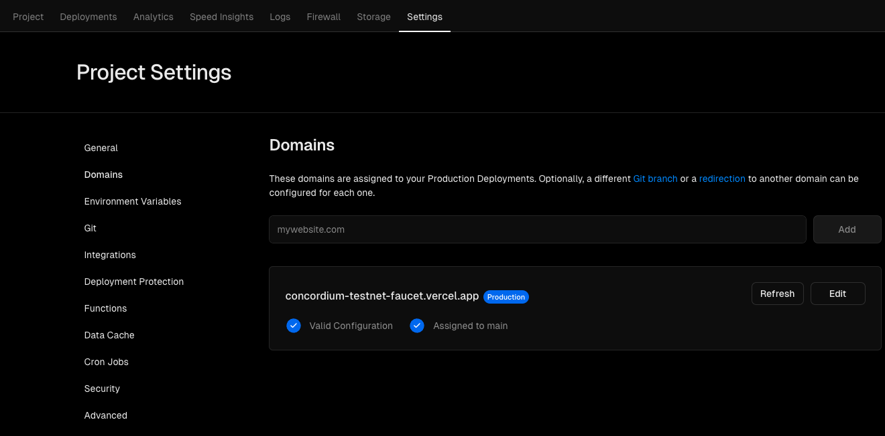

2. Fill in your domain and click Add.
   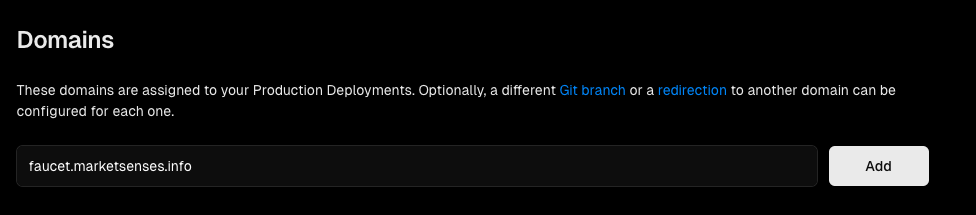

3. Note the table values, To use in the next step.
   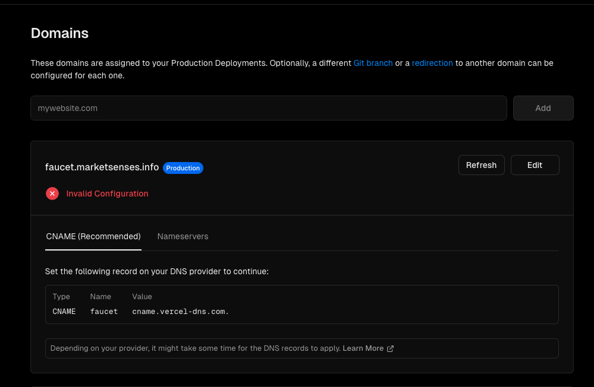

4. Go to the domain management panel, where you or your team has the domain registered, and then DNS Settings. And add a new CNAME record. Fill up with the values from the previous step.
   Name -> Host and Value -> Value .
   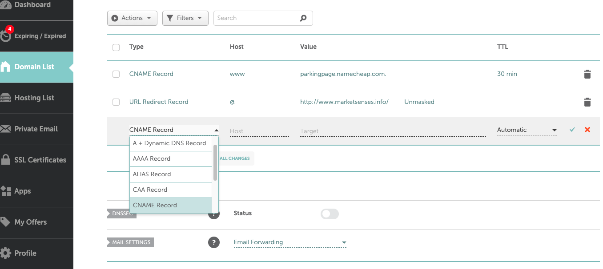
   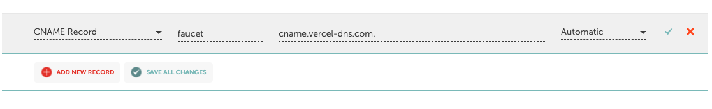
   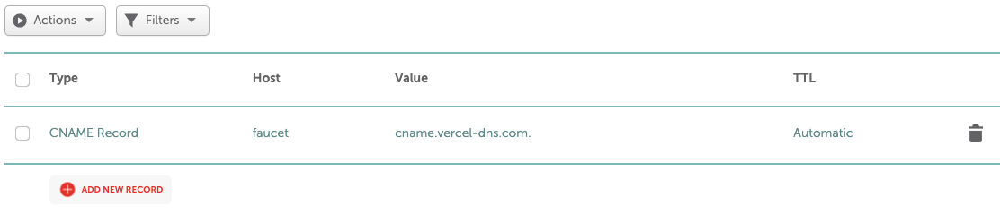

5. Go back to the project in Settings/Vercel Domains and wait for it to look like this.
   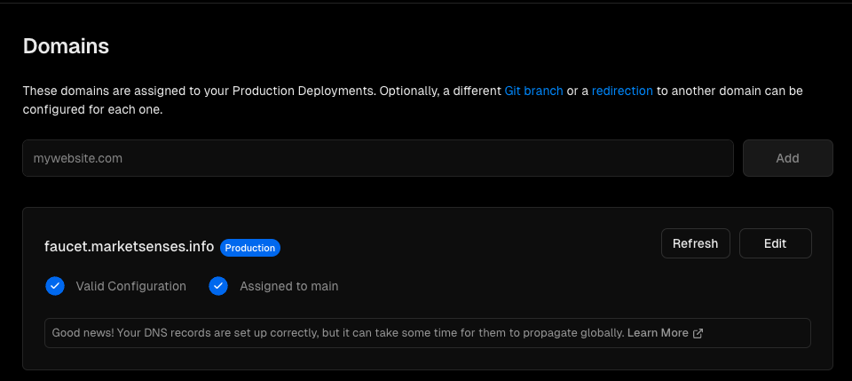

6. In your Cloudflare dashboard. Go to Turnstile and fill it in as follows.
   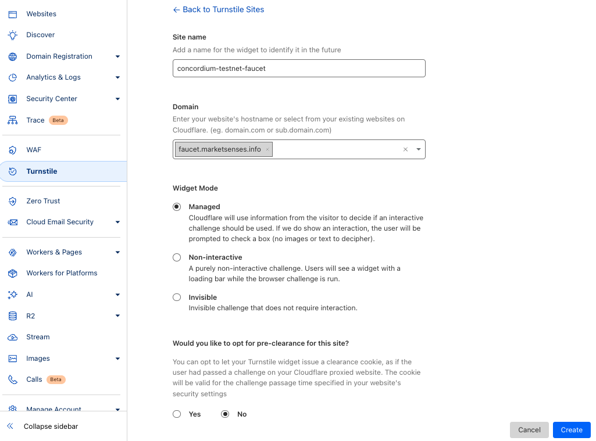

7. Click on create and copy the sitekey and the secret
   
   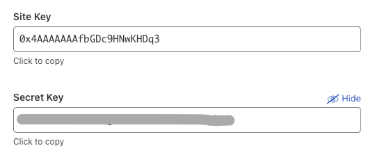

8. Go to the project on Vercel, then navigate to Settings > Environment Variables and update the variables NEXT_PUBLIC_CLOUDFLARE_TURNSTILE_SITE_KEY and CLOUDFLARE_TURNSTILE_SECRET.
   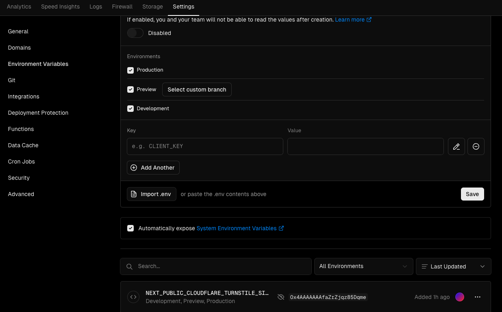

9.  Go to Deployments and click on the three points of the last deployment and then click on redeploy.
   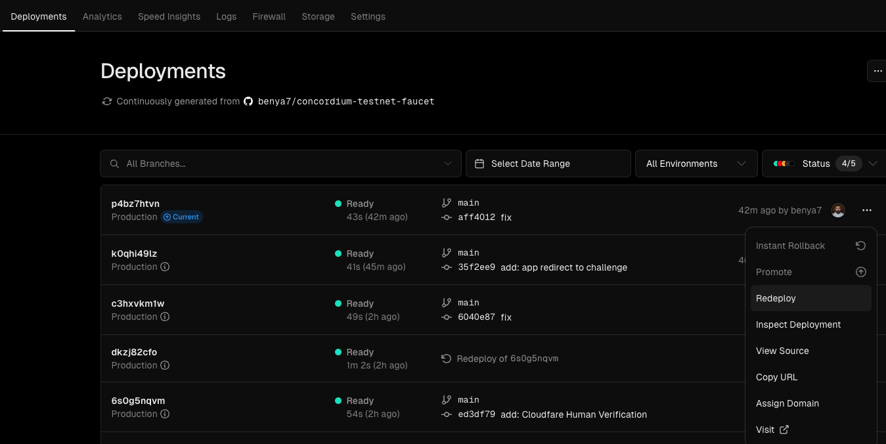

That's it, the produccion domain and the Cloudfare Human Verification is ready now. 🎉
